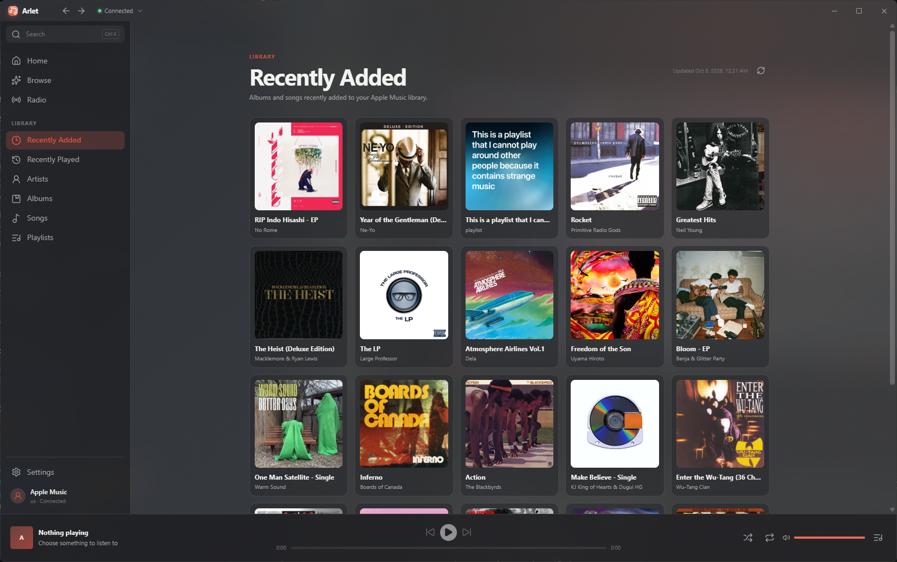
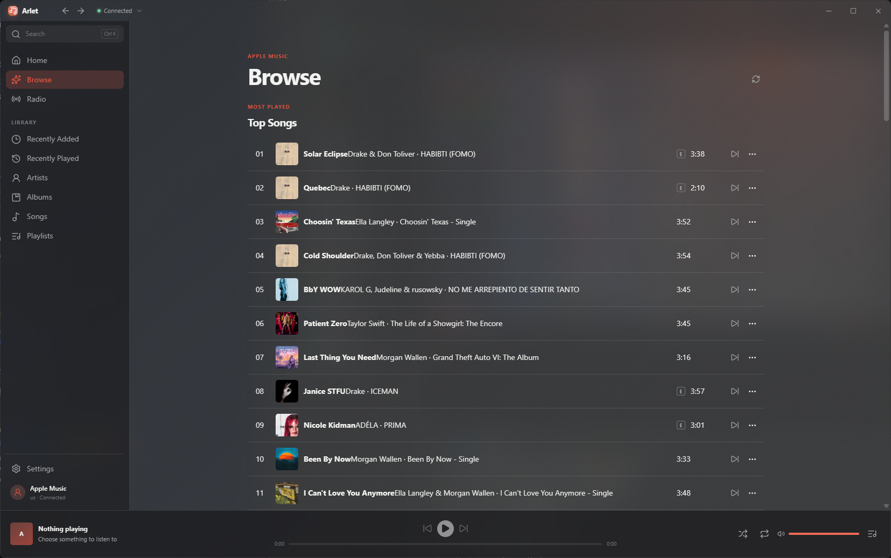
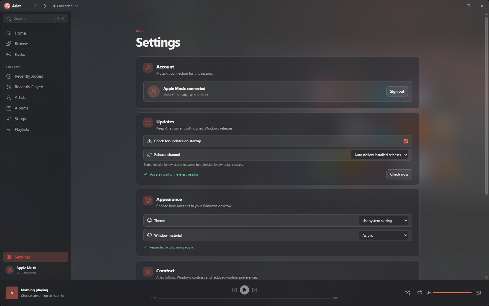

  

<h1 align="center">Arlet</h1>

  An unofficial <strong>Apple Music client for Windows</strong> 10 and 11: a
  fast, native-feeling desktop app built with Tauri v2, Rust, and MusicKit.
  Arlet is in alpha development.

<!-- arlet-downloads:start -->

  
  

<!-- arlet-downloads:end -->

  Windows 10 22H2 or newer. <a href="https://github.com/BurntToasters/Arlet/releases/latest">All releases and signatures</a>

## Features

- **Your Apple Music library on the Windows desktop:** recently added,
  recently played, artists, albums, songs, and playlists with folders, cached
  for a fast start.
- **Home and Browse:** recently played playlists, heavy rotation, personal
  recommendations, Apple Music charts, and radio stations.
- **Search** the full Apple Music catalog or just your library.
- **Playlists:** create playlists and folders, add songs, and pin favorites to
  the sidebar.
- **Queue control:** play now, play next, play later, shuffle, and repeat.
- **Built for Windows:** media keys and the Windows media overlay, light and
  dark themes, and Mica or Acrylic window materials.
- **Automatic, signed updates** on a stable or beta channel. Installers are
  Authenticode-signed and GPG-signed.

## Install

1. Download the installer for your PC above (x64 for most PCs, Arm64 for
   Snapdragon and other Arm devices).
2. Run it. Arlet installs for your user account only, no administrator
   rights needed.
3. Sign in with the Apple ID that has your Apple Music subscription.

## Screenshots

  
   
  Your library: recently added albums and playlists.

<table>
  <tr>
    <td width="50%" align="center">
      
       
      Browse Apple Music charts.
    </td>
    <td width="50%" align="center">
      
       
      Settings: account, updates, theme, and Mica or Acrylic.
    </td>
  </tr>
</table>

## Requirements

- Windows 10 version 22H2 (build 19045) or newer, or Windows 11. Older
  Windows versions are not supported.
- An Apple Music subscription for full-length playback.

## Development

1. Install Node.js (see `engines` in `package.json`), npm 12, and the Rust
   toolchain (`npm run rust:update`).
2. `npm ci`
3. Copy `.env.example` to `.env` and set `MUSICKIT_DEVELOPER_TOKEN`
   (`npm run phase0:mint-token` can mint it from your Media Services key).
4. `npm start`

## Checks

- `npm run test:all`: typecheck, lint, format, Vitest, script tests, Rust
  fmt/Clippy/tests, and the offline build smoke.
- `npm run test:e2e:app`: native E2E against a release build (Windows).

## Documentation

- [ARCHITECTURE.md](ARCHITECTURE.md): code layout and data flow.
- [docs/SECURITY.md](docs/SECURITY.md): capabilities, tokens, logging.
- [docs/RELEASE.md](docs/RELEASE.md): release machine setup and flow.
- [docs/TESTING.md](docs/TESTING.md): test boundaries and E2E.

## Disclaimer

Arlet is an independent, unofficial project. It is not affiliated with,
endorsed by, or sponsored by Apple Inc. Apple Music and MusicKit are
trademarks of Apple Inc. An active Apple Music subscription is required for
full-length playback.

## License

Arlet is free software under the
[GNU General Public License v3.0 only](LICENSE).
